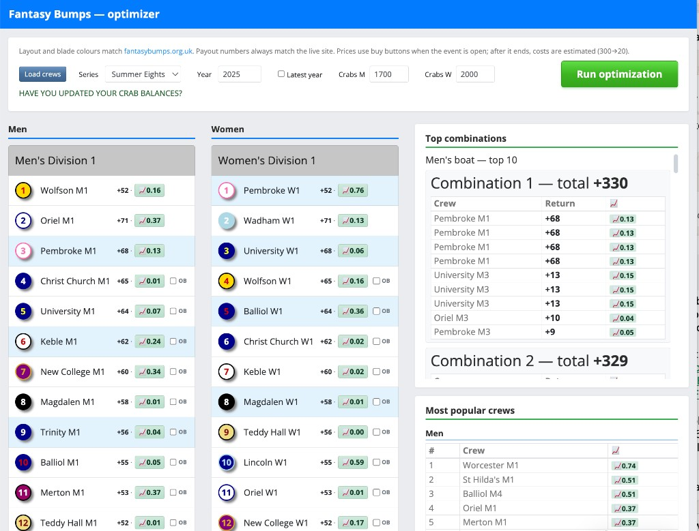

<<<<<<< HEAD
# Fantasy Bumps — optimizer (web UI)

Flask app that loads crew data from [fantasybumps.org.uk](https://fantasybumps.org.uk/) and runs combination search with budgets and overbump-style rules.

## Example (web UI)

Load crews, pick boats and overbumps, set crab budgets, then **Run optimization** to see top combinations and popularity sidebars.




## Get the code from GitHub

On your machine, pick **one** of these:

**Clone with Git** (stays linked for `git pull` updates):

```bash
git clone https://github.com/YOUR_USERNAME/YOUR_REPO.git
cd YOUR_REPO
```

**Download ZIP** (no Git needed): open your repo on GitHub → green **Code** → **Download ZIP** → unzip → `cd` into the folder in a terminal.

---

## Run it locally

You need **Python 3.10+** (3.11 is fine).

### 1. Dependencies

```bash
pip install -r requirements.txt
```

If you use a venv (recommended):

```bash
python3 -m venv .venv
source .venv/bin/activate   # Windows: .venv\Scripts\activate
pip install -r requirements.txt
```

### 2. Start the app (opens your browser)

```bash
chmod +x run.sh    # once, if macOS/Linux says “Permission denied”
./run.sh
```

This serves the UI at **http://127.0.0.1:5050** and tries to open that URL in your default browser after a short delay (macOS `open`, Linux `xdg-open`, Git Bash `explorer.exe`).

**Optional:** custom Python or port:

```bash
FANTASY_BUMPS_PYTHON=/path/to/python3 FANTASY_BUMPS_PORT=5050 ./run.sh
```

### Other ways to run

- **Foreground, no browser:**  
  `python3 app.py`  
  then open **http://127.0.0.1:5050** yourself (port follows `FANTASY_BUMPS_PORT`).

- **Background / stop / toggle (advanced):**  
  `./run_web.sh --help`


